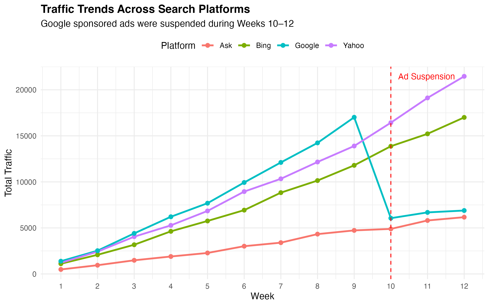
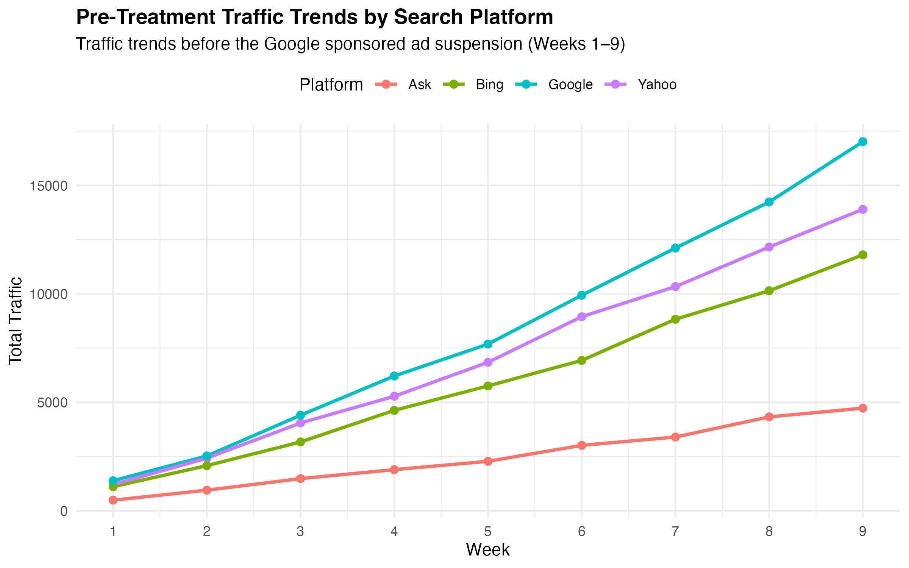
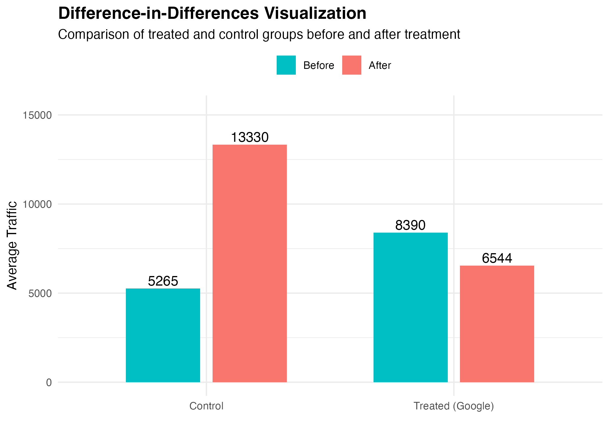
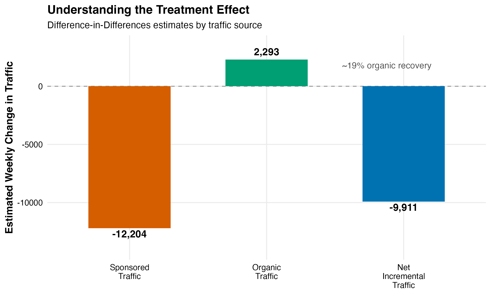

# Estimating Incremental Advertising ROI: A Difference-in-Differences Analysis

Estimate the **causal impact** of sponsored search advertising using a **Difference-in-Differences (DiD)** framework and evaluate advertising ROI based on **incremental traffic** rather than raw paid clicks.

---

## Project Overview

Traditional advertising ROI calculations often assume that every paid click is generated by advertising. However, for **branded keyword searches**, many users would likely visit the website through organic search even if sponsored ads were not displayed.

This project leverages a natural experiment created by the temporary suspension of Google sponsored ads to estimate the causal impact of advertising on website traffic. A Difference-in-Differences (DiD) framework is then used to estimate incremental traffic by comparing Google with unaffected search platforms.

---

## Business Question

**Do sponsored search ads generate truly incremental traffic, or are companies paying for clicks they would have received organically?**

This question is important because branded search users already have high intent. If many paid clicks would have occurred through organic search anyway, traditional advertising ROI can misrepresent the true business value of sponsored ads.

---

## Natural Experiment

A technical glitch suspended **Google sponsored ads during Weeks 10–12**, while ads on **Bing, Yahoo, and Ask** continued running normally.

| Component | Description |
|-----------|-------------|
| Treatment Group | Google |
| Control Group | Bing, Yahoo, Ask |
| Pre-Treatment Period | Weeks 1–9 |
| Post-Treatment Period | Weeks 10–12 |
| Outcome Variable | Total Traffic |

---

## Methodology

The analysis follows a structured causal inference workflow:

1. Identify why click-based ROI is biased
2. Define treatment and control groups
3. Visualize overall traffic trends
4. Check pre-treatment trends
5. Estimate a naive pre-post model
6. Estimate treatment effect using Difference-in-Differences
7. Decompose treatment effects into sponsored and organic traffic
8. Recalculate ROI using incremental traffic
9. Translate findings into business recommendations

---

## Analytical Workflow

```text
Business Question
↓
Natural Experiment
↓
Pre-Post Comparison
↓
Difference-in-Differences
↓
Treatment Effect Decomposition
↓
Incremental ROI Estimation
↓
Managerial Recommendation
```

---

## Key Findings

| Metric | Value |
|--------|------:|
| Estimated Incremental Traffic | **9,911 visits/week** |
| Incremental Conversions | **1,189** |
| Contribution Margin | **$24,975** |
| Advertising Cost | **$3,674** |
| Estimated Incremental ROI* | **580%** |

\* Estimated using the scaled case dataset and intended for relative comparison rather than direct business valuation.

The Difference-in-Differences estimate suggests that suspending Google sponsored ads reduced weekly traffic by approximately **9,911 visits** relative to the control platforms.

The corrected ROI calculation is based on estimated incremental traffic rather than observed paid clicks, making it a more causally grounded measure of advertising effectiveness.

---

## Visualizations

### Overall Traffic Trends



### Parallel Trends Check



### Difference-in-Differences Visualization



### Treatment Effect Decomposition



---

## Business Recommendation

Bazaar.com should continue investing in sponsored search advertising, but should evaluate campaign performance using **incremental impact** rather than raw click volume.

The analysis suggests that sponsored search ads generate positive incremental traffic, but the exact ROI magnitude should be interpreted with caution because the dataset is scaled. Future campaign evaluation should continue to prioritize incremental impact measurement through randomized experiments, geo-based holdout tests, or similar causal inference methods where feasible.

---

## Skills Demonstrated

- Causal Inference
- Difference-in-Differences (DiD)
- Counterfactual Analysis
- Experimental Design
- Marketing Analytics
- Business Analytics
- Data Visualization
- R
- tidyverse
- ggplot2
- dplyr
- R Markdown

---

## Repository Structure

```text
incremental-roi-sponsored-search/
│
├── README.md
├── sponsored_search_incremental_roi.Rmd
├── sponsored_search_incremental_roi.pdf
└── figures/
    ├── overall_traffic_trends.png
    ├── parallel_trends.png
    ├── did_visualization.png
    └── treatment_effect_decomposition.png
```

---

## Data Availability

The original dataset is not included because it is distributed as part of a copyrighted academic case study.

This repository focuses on the analytical workflow, causal inference methodology, and reproducible R implementation.

---

## Author

**Camille Hsu**

M.S. Business Analytics  
Carlson School of Management  
University of Minnesota