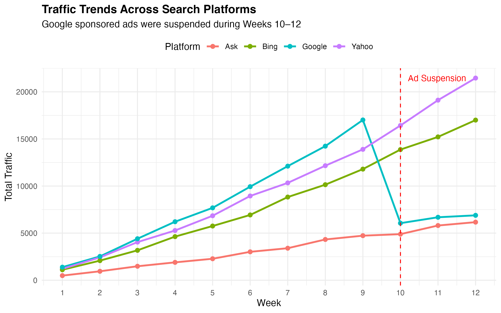
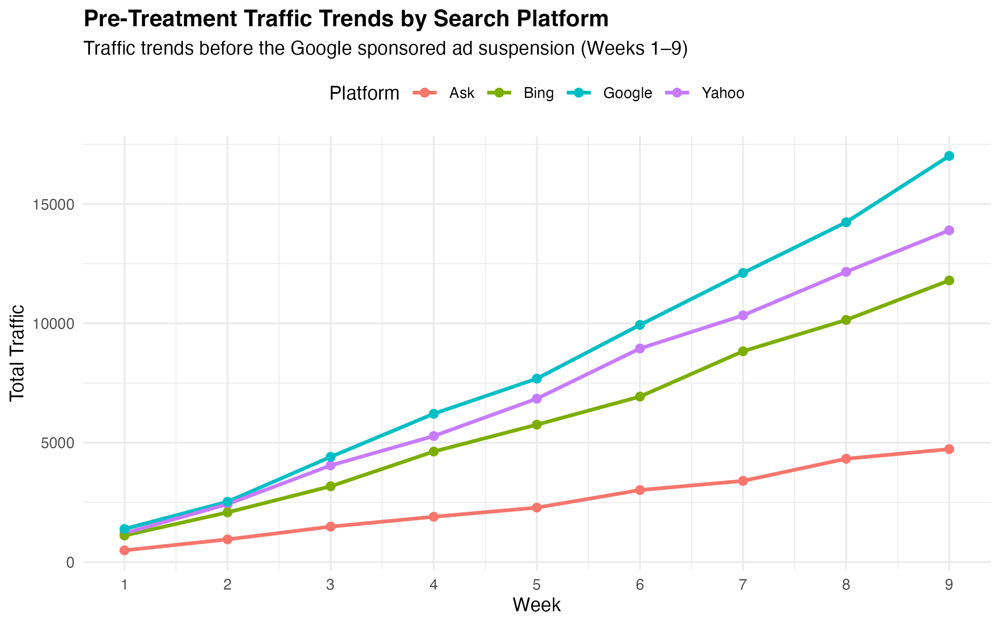
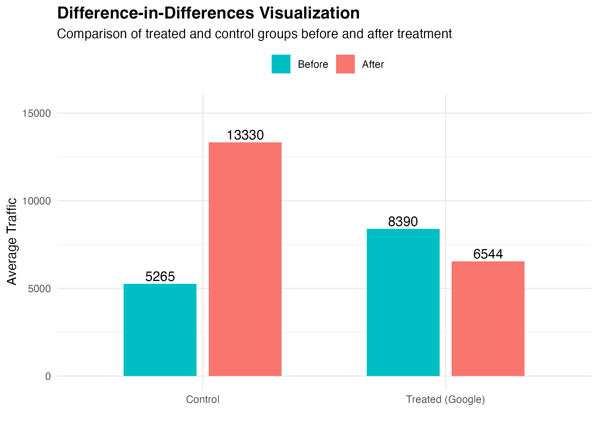
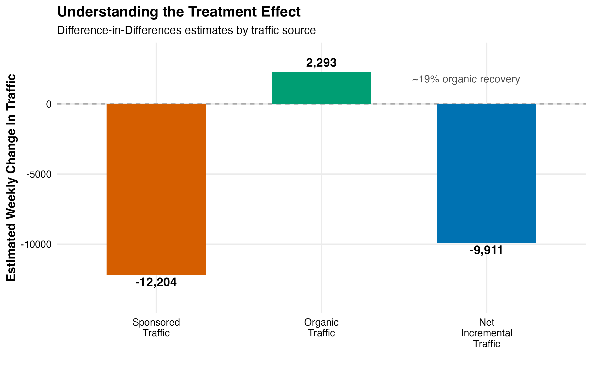

# Estimating Incremental Advertising ROI: A Difference-in-Differences Analysis

Estimate the incremental effect of sponsored search advertising using a **Difference-in-Differences (DiD)** framework, state the assumptions required for a causal interpretation, and evaluate ROI using **incremental traffic** rather than raw paid clicks.

---

## Project Overview

Traditional advertising ROI calculations often assume that every paid click is generated by advertising. However, for **branded keyword searches**, many users would likely visit the website through organic search even if sponsored ads were not displayed.

This project leverages a natural experiment created by the temporary suspension of Google sponsored ads to estimate the causal impact of advertising on website traffic. A Difference-in-Differences (DiD) framework is then used to estimate incremental traffic by comparing Google with unaffected search platforms.

---

## Business Question

**Do sponsored search ads generate truly incremental traffic, or are companies paying for clicks they would have received organically?**

This question is important because branded search users already have high intent. If many paid clicks would have occurred through organic search anyway, traditional advertising ROI can misrepresent the true business value of sponsored ads.

---

## Natural Experiment

A technical glitch suspended **Google sponsored ads during Weeks 10–12**, while ads on **Bing, Yahoo, and Ask** continued running normally.

| Component | Description |
|-----------|-------------|
| Treatment Group | Google |
| Control Group | Bing, Yahoo, Ask |
| Pre-Treatment Period | Weeks 1–9 |
| Post-Treatment Period | Weeks 10–12 |
| Outcome Variable | Total Traffic |

---

## Methodology

The analysis follows a structured causal inference workflow:

1. Identify why click-based ROI is biased
2. Define treatment, control, and identification assumptions
3. Visualize overall traffic and pre-treatment trends
4. Compare a naive pre-post model with Difference-in-Differences
5. Quantify uncertainty with a confidence interval
6. Run a pre-period placebo and leave-one-control-out sensitivity checks
7. Decompose sponsored and organic traffic effects
8. Translate incremental traffic into scenario-based ROI decisions

---

## Identification and Evidence Boundary

The temporary Google ad suspension is plausibly exogenous, but the causal interpretation still depends on assumptions that cannot be proven from this small case dataset:

- Google and the control platforms would have followed parallel trends without the interruption.
- The Google interruption did not shift users to Bing, Yahoo, or Ask.
- No concurrent Google-specific event changed traffic during Weeks 10-12.
- The selected control-platform average is a reasonable counterfactual for Google.

The project uses a visual pre-trend check, a pre-period placebo interruption, and leave-one-control-out estimates as diagnostics. With only four platforms, nine pre-treatment weeks, and three post-treatment weeks, uncertainty estimates and robustness checks should be interpreted as supporting evidence rather than proof of identification.

---

## Analytical Workflow

```text
Business Question
↓
Natural Experiment
↓
Pre-Post Comparison
↓
Difference-in-Differences
↓
Treatment Effect Decomposition
↓
Incremental ROI Estimation
↓
Managerial Recommendation
```

---

## Key Findings

### Estimated campaign effect

| Metric | Estimate | Evidence type |
|--------|---------:|---------------|
| Incremental Traffic | **9,911 visits/week** | DiD point estimate |
| Organic Recovery | **19%** | Treatment-effect decomposition |

The DiD estimate suggests that suspending Google sponsored ads reduced weekly traffic by approximately **9,911 visits** relative to the selected control platforms. This interpretation is conditional on the identification assumptions above.

### Scenario-based financial translation

| Metric | Scenario Value |
|--------|---------------:|
| Incremental Conversions | **1,189** |
| Contribution Margin | **$24,975** |
| Advertising Cost | **$3,674** |
| Incremental ROI | **580%** |

The financial values use the scaled case dataset and assumed conversion and contribution-margin inputs. They illustrate how an incremental traffic estimate can support a budget decision; they are **not observed company financial results**.

The R Markdown report also calculates a conventional 95% confidence interval, a pre-treatment placebo estimate, and leave-one-control-out sensitivity results. Because the panel is very small, these diagnostics should be read alongside—not in place of—the design assumptions.

---

## Visualizations

### Overall Traffic Trends



### Parallel Trends Check



### Difference-in-Differences Visualization



### Treatment Effect Decomposition



---

## Business Recommendation

Bazaar.com should continue investing in sponsored search advertising, but should evaluate campaign performance using **incremental impact** rather than raw click volume.

The analysis suggests that sponsored search ads generate positive incremental traffic, but the exact ROI magnitude should be interpreted with caution because the dataset is scaled. Future campaign evaluation should continue to prioritize incremental impact measurement through randomized experiments, geo-based holdout tests, or similar causal inference methods where feasible.

---

## Skills Demonstrated

- Causal Inference
- Difference-in-Differences (DiD)
- Counterfactual Analysis
- Experimental Design
- Marketing Analytics
- Business Analytics
- Data Visualization
- R
- tidyverse
- ggplot2
- dplyr
- R Markdown

---

## Repository Structure

```text
incremental-roi-sponsored-search/
│
├── README.md
├── sponsored_search_incremental_roi.Rmd
├── sponsored_search_incremental_roi.pdf
└── figures/
    ├── overall_traffic_trends.png
    ├── parallel_trends.png
    ├── did_visualization.png
    └── treatment_effect_decomposition.png
```

---

## Data Availability

The original dataset is not included because it is distributed as part of a copyrighted academic case study.

This repository focuses on the analytical workflow, causal inference methodology, and reproducible R implementation.

---

## Author

**Camille Hsu**

M.S. Business Analytics  
Carlson School of Management  
University of Minnesota
